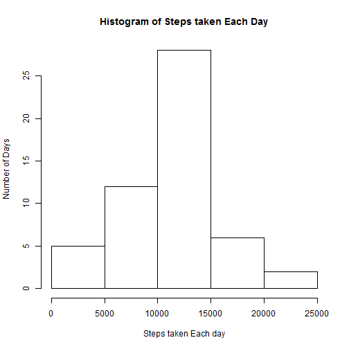
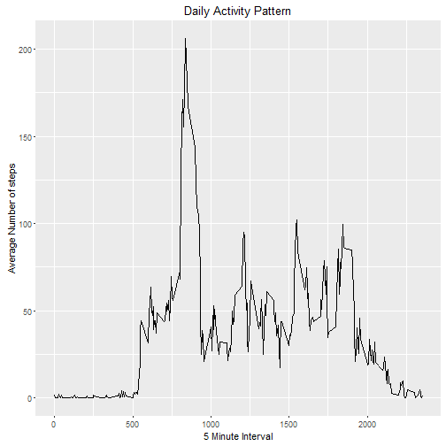
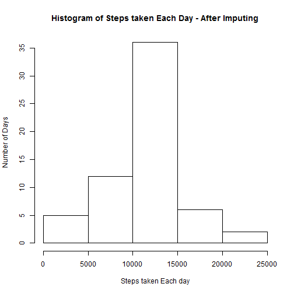
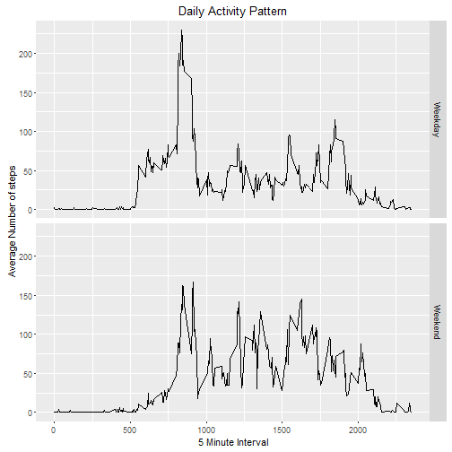

# Part 1
## Loading and preprocessing the data
In this Section, the activity data is loaded. If we run the command str(activitydat), it can be seen that, the date variable is stored as a factor. So, one of the preprocessing steps is to convert the date variable into Date data type.

```r
activitydat <- read.csv("activity.csv")
activitydat$date <- as.Date(activitydat$date)
str(activitydat)
```

```
## 'data.frame':	17568 obs. of  3 variables:
##  $ steps   : int  NA NA NA NA NA NA NA NA NA NA ...
##  $ date    : Date, format: "2012-10-01" "2012-10-01" ...
##  $ interval: int  0 5 10 15 20 25 30 35 40 45 ...
```
# Part 2
## What is mean total number of steps taken per day?
In this Section, the total number of steps for each day is calculated using the aggregate function. A sample of the aggregation is shown below. Then, a histogram of the number of steps taken each day is plotted. Finally, the mean and median of the total number of steps is calculated.

```r
steps_day <- aggregate(steps ~ date, sum, data = activitydat)
head(steps_day)
```

```
##         date steps
## 1 2012-10-02   126
## 2 2012-10-03 11352
## 3 2012-10-04 12116
## 4 2012-10-05 13294
## 5 2012-10-06 15420
## 6 2012-10-07 11015
```

```r
hist(steps_day$steps, 
     xlab = "Steps taken Each day",
     ylab = "Number of Days",
     main = "Histogram of Steps taken Each Day")
```



```r
mean(steps_day$steps)
```

```
## [1] 10766.19
```

```r
median(steps_day$steps)
```

```
## [1] 10765
```
# Part 3
## What is the average daily activity pattern?
In this Section, the daily activity pattern averaged over the 5 minute interval is studied via a time series plot. The interval containing the maximum number of steps is also found.

```r
pattern <- aggregate(steps ~ interval, mean, data = activitydat)
library(ggplot2)
qplot(interval,steps,data = pattern, 
      geom = "line", 
      xlab = "5 Minute Interval",
      ylab = "Average Number of steps",
      main = "Daily Activity Pattern")
```



```r
pattern[(pattern$steps == max(pattern$steps)),]
```

```
##     interval    steps
## 104      835 206.1698
```
# Part 4
## Imputing missing values
* Calculating the Number of missing values in the data set.

```r
NumMissing <- which(is.na(activitydat))
```
The Number of missing values in the dataset is 2304

* Imputing Missing Values using Mean  
The Missing values are imputed using the mean number of steps for each day and interval.

```r
imputedat <- activitydat
for (i in 1 : nrow(imputedat))
{
  if(is.na(imputedat$steps[i]))
  {
    ind <- which((pattern$interval == imputedat$interval[i]))
    imputedat$steps[i] <- pattern$steps[ind]
  }
}
```
* New data set with imputed values.

```r
head(imputedat)
```

```
##       steps       date interval
## 1 1.7169811 2012-10-01        0
## 2 0.3396226 2012-10-01        5
## 3 0.1320755 2012-10-01       10
## 4 0.1509434 2012-10-01       15
## 5 0.0754717 2012-10-01       20
## 6 2.0943396 2012-10-01       25
```
* Histogram and report of Mean and Median

```r
imp_steps_day <- aggregate(steps ~ date, sum, data = imputedat)
head(imputedat)
```

```
##       steps       date interval
## 1 1.7169811 2012-10-01        0
## 2 0.3396226 2012-10-01        5
## 3 0.1320755 2012-10-01       10
## 4 0.1509434 2012-10-01       15
## 5 0.0754717 2012-10-01       20
## 6 2.0943396 2012-10-01       25
```

```r
hist(imp_steps_day$steps, 
     xlab = "Steps taken Each day", 
     ylab = "Number of Days", 
     main = "Histogram of Steps taken Each Day - After Imputing")
```



```r
mean(imp_steps_day$steps)
```

```
## [1] 10766.19
```

```r
median(imp_steps_day$steps)
```

```
## [1] 10766.19
```
# Part 5
## Are there differences in activity patterns between weekdays and weekends?
* Creating a new factor variable - day
In this section a new variable day is created.

```r
library(timeDate)
for (i in 1: nrow(imputedat)) 
  {
  if(isWeekend(imputedat$date[i])) 
    imputedat$day[i] <- "Weekend" 
  else 
    imputedat$day[i] <- "Weekday" 
  }

imputedat$day <- as.factor(imputedat$day)
```
* Creating a Panel Plot for Weekdays and Weekends

```r
patternwk <- aggregate(steps ~ interval+day, mean, data = imputedat)
qplot(interval,steps,data = patternwk, 
      geom = "line", 
      xlab = "5 Minute Interval",
      ylab = "Average Number of steps",
      main = "Daily Activity Pattern", facets = (day ~ .)
      )
```


